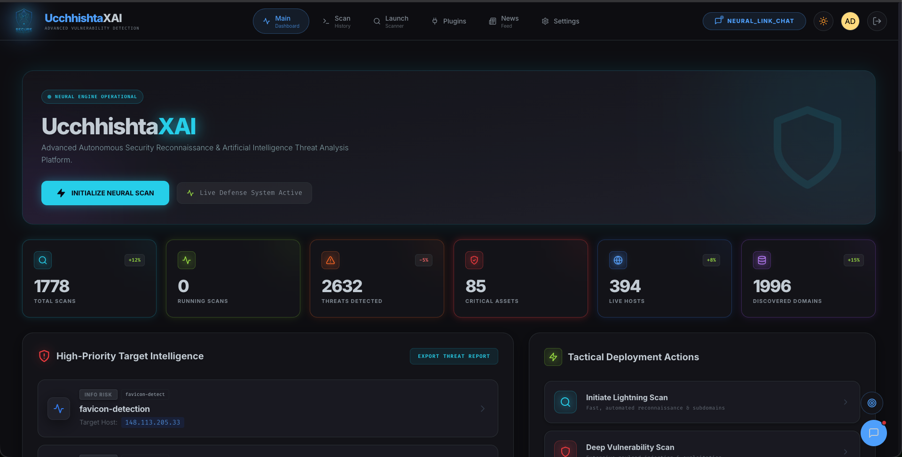
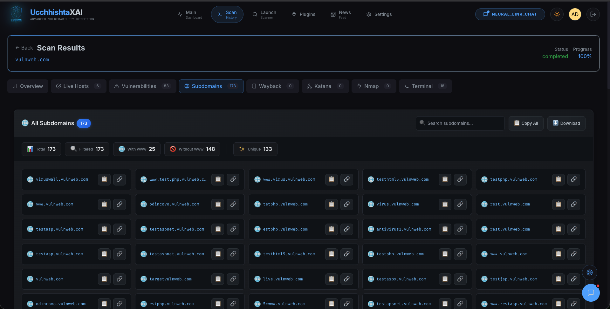

# UcchhishtaXAI

## AI-Powered Autonomous Penetration Testing Platform

[](https://python.org)
[](https://fastapi.tiangolo.com)
[](https://mongodb.com)
[](LICENSE)

**"Precision in Penetration Testing, Intelligence in Vulnerability Discovery"**

---

## What is UcchhishtaXAI?

UcchhishtaXAI is an enterprise-grade autonomous penetration testing platform that combines **AI-driven multi-agent orchestration** with **containerized security tooling**. Unlike traditional pentesting tools that operate in isolation, UcchhishtaXAI provides an intelligent, loop-based agent workflow that plans, executes, analyzes output, and dynamically adjusts strategy—all under human oversight.

**Core Philosophy**: Full automation with human-in-the-loop control. The agent doesn't just run commands—it **thinks**, **adapts**, and **reports** like a senior penetration tester.

---

## Key Differentiators

| Feature | Traditional Tools | UcchhishtaXAI |
|---------|------------------|---------------|
| **Agentic Workflow** | Single-shot scans | Continuous loop: Plan → Execute → Analyze → Re-Plan → Report |
| **Tool Context** | Manual selection | RAG-augmented command generation from 150+ tool docs |
| **Shell Access** | N/A | Full exploit chain: discovery → foothold → privilege escalation |
| **Kali Environment** | Host-dependent | Docker-isolated Kali sandbox with 200+ pre-installed tools |
| **CVE Intelligence** | Static database | Real-time NVD sync + nuclei-templates + web search |
| **Human Oversight** | None | Every command paused for approval before execution |
| **Learning** | None | Conversation memory with semantic search for context |

---

## Product Screenshots

The screenshots below show UcchhishtaXAI as a full penetration testing workspace: from authentication and dashboards to live reconnaissance, AI-assisted command execution, CVE intelligence, RAG context, reports, and scan history.

### Access & Theme

| Screenshot | Description |
|------------|-------------|
|  | **Login Page** — Secure entry point for authenticated users with JWT-based access control before using scans, reports, and AI workflows. |
|  | **Signup Page** — User onboarding flow with role-aware account creation for controlled team access. |
|  | **Light Mode** — Alternate bright interface theme for comfortable use in different environments. |

### Dashboard & Administration

| Screenshot | Description |
|------------|-------------|
|  | **Dashboard** — Central command view for monitoring platform activity, scan status, findings, and operational security metrics. |
|  | **Dashboard Graph** — Visual summary of scan activity and security posture trends for quick review. |
|  | **Dashboard Graphs** — Multiple analytics panels for comparing reconnaissance output, vulnerability volume, and system activity. |
|  | **Admin Panel** — RBAC administration area for managing users, roles, permissions, and platform access. |

### Scan Launching & Reconnaissance

| Screenshot | Description |
|------------|-------------|
|  | **Scan Launcher** — Configure and start penetration testing workflows with options for recon, nuclei, nmap, katana, and deeper scan phases. |
|  | **Bulk Scan** — Run multiple target scans efficiently while the backend controls concurrency and tracks progress. |
|  | **Scan Overview** — High-level summary of an active or completed scan, including target, phases, status, and discovered attack surface. |
|  | **Live Subdomains** — Real-time subdomain discovery results from tools such as subfinder, assetfinder, findomain, and Chaos. |
|  | **Subdomains** — Organized subdomain inventory for reviewing discovered assets before probing and vulnerability checks. |
|  | **Live Host Details** — HTTP probing results with live URLs, status codes, technologies, and reachable services. |
|  | **Live Terminal** — Streaming terminal output for scan and agent activity through WebSocket-powered live updates. |

### Vulnerability & Network Findings

| Screenshot | Description |
|------------|-------------|
|  | **Nuclei Details** — Vulnerability result details from nuclei templates, including severity, evidence, and matched target data. |
|  | **Nuclei & Port Scan Results** — Combined vulnerability and service discovery view for correlating exposed ports with security findings. |
|  | **Vulnerability Findings** — Findings list for triage, severity review, and remediation planning. |
|  | **Detailed Vulnerability Findings** — Additional findings view focused on discovered issues and affected assets. |
|  | **Latest Vulnerability Details** — Detailed vulnerability intelligence view with context for newly identified weaknesses. |
|  | **Vulnerability Intelligence** — Intelligence dashboard for tracking vulnerability context, affected technologies, and risk information. |
|  | **Vulnerability Intelligence Panel** — Central place to review vulnerability intelligence and prioritize research. |

### Katana & Wayback Discovery

| Screenshot | Description |
|------------|-------------|
|  | **Katana Deep Crawl** — Deep crawling workflow for discovering JavaScript files, hidden routes, parameters, and application endpoints. |
|  | **Katana Endpoint Details** — Endpoint-level crawl output for inspecting discovered URLs and web application structure. |
|  | **Wayback Historical Data** — Archived URL discovery for finding legacy endpoints, old paths, and forgotten attack surface. |
|  | **Wayback URL Details** — Detailed historical URL records for deeper endpoint review and parameter hunting. |

### AI Agent & Human Approval

| Screenshot | Description |
|------------|-------------|
|  | **AI Assistant Floating Window** — Always-available assistant for asking security questions, interpreting output, and planning next steps. |
|  | **AI Command Execution** — Agent-generated command workflow for running security tools inside the controlled environment. |
|  | **AI Command Execution Details** — Command metadata, reasoning, and execution context before or after tool runs. |
|  | **Agent Command Output** — Live command output produced by the AI agent and streamed back for review. |
|  | **AI Output Explanation** — AI explains command results and suggests the next penetration testing step based on evidence. |
|  | **Human-in-the-Loop Approval** — Safety checkpoint where every agent command can be approved, rejected, or modified before execution. |

### RAG, CVE & Plugin Intelligence

| Screenshot | Description |
|------------|-------------|
|  | **AI RAG Details** — Retrieval-augmented context showing how tool documentation and security knowledge improve agent decisions. |
|  | **AI Latest CVE Information** — AI-assisted CVE lookup for current vulnerability context and remediation guidance. |
|  | **AI CVE Copy Workflow** — Quick copy/share flow for CVE details, useful during reporting and research. |
|  | **AI CVE Failure Details** — Error-aware CVE workflow view for diagnosing failed lookups or copy actions. |
|  | **Plugin Intelligence** — Intelligence workspace for security plugin data, templates, and contextual references. |
|  | **Plugin Intelligence Template** — Template-focused view for understanding detection logic and reusable security checks. |
|  | **Plugin Intelligence References** — Reference material connected to plugins, CVEs, templates, and vulnerability research. |
|  | **Plugin CVE Details** — CVE-level intelligence connected to plugin or template findings. |
|  | **Plugin Reconnaissance Intelligence** — Recon-oriented intelligence for selecting tools, templates, and next actions. |
|  | **Plugin Intelligence Syncing** — Sync view for keeping local intelligence and templates updated. |
|  | **Threat Intelligence Feed** — Security news and threat feed view for staying current with emerging attacks and vulnerabilities. |

### Reports & Scan History

| Screenshot | Description |
|------------|-------------|
|  | **Scan Report** — Generated report output for sharing findings, evidence, severity, and remediation notes. |
|  | **Scan History** — Historical record of previous scans, targets, statuses, timestamps, and results for repeatable research. |
|  | **Scan History Actions** — Action controls for opening, reviewing, deleting, or managing saved scan records. |

---

## Architecture Overview

```
┌─────────────────────────────────────────────────────────────────────────────┐
│                           FRONTEND (React 18 + Vite)                         │
│   Dashboard │ Scan Launcher │ AI Terminal │ CVE Browser │ Live Results       │
└──────────────────────────────────┬──────────────────────────────────────────┘
                                   │ WebSocket (real-time) + REST API
┌──────────────────────────────────▼──────────────────────────────────────────┐
│                        BACKEND (FastAPI + Python 3.13)                      │
│                                                                              │
│  ┌─────────────────┐  ┌─────────────────────────┐  ┌──────────────────────┐ │
│  │  Recon Engine   │  │    MCP Server          │  │  WebSocket Manager   │ │
│  │  6-Phase Pipeline│  │  ┌────────────────┐   │  │                      │ │
│  │  • Subdomains   │  │  │ LLM Integration │   │  │  Real-time scan &    │ │
│  │  • HTTPX         │  │  │ (Multi-Provider)│   │  │  agent output        │ │
│  │  • Wayback       │  │  ├────────────────┤   │  │                      │ │
│  │  • Nuclei        │  │  │ LangGraph Agent│   │  │                      │ │
│  │  • Nmap          │  │  │ (HITL Enabled) │   │  │                      │ │
│  │  • Katana        │  │  ├────────────────┤   │  │                      │ │
│  │                 │  │  │ RAG Enricher   │   │  │                      │ │
│  │                 │  │  │ (150+ tools)   │   │  │                      │ │
│  │                 │  │  ├────────────────┤   │  │                      │ │
│  │                 │  │  │ Conv. Memory   │   │  │                      │ │
│  │                 │  │  │ (MongoDB+Vec)  │   │  │                      │ │
│  └─────────────────┘  └─────────────────────────┘  └──────────────────────┘ │
└──────────────────────────────────┬──────────────────────────────────────────┘
                                   │
        ┌──────────────────────────┼──────────────────────────┐
        ▼                          ▼                          ▼
┌─────────────────┐   ┌──────────────────┐     ┌─────────────────────────────┐
│  MongoDB        │   │  ChromaDB        │     │  Kali Docker Container      │
│  (Primary DB)   │   │  (Vector Store) │     │  ┌────────────────────────┐ │
│  • Scans        │   │  • Tool docs    │     │  │  200+ Kali tools       │ │
│  • Results      │   │  • Conv. memory │     │  │  • nmap, nikto, sqlmap  │ │
│  • Chats        │   │  • CVE data     │     │  │  • hydra, john, hashcat │ │
│  • CVE templates│   │                 │     │  │  • ffuf, gobuster       │ │
│  • Audit logs   │   │                 │     │  │  Go tools:             │ │
│                 │   │                 │     │  • subfinder, httpx     │ │
│                 │   │                 │     │  • nuclei, katana       │ │
└─────────────────┘   └──────────────────┘     │  • assetfinder, findomain │ │
                                                │  + nuclei-templates       │ │
                                                └────────────────────────────┘ │
                                                ┌─────────────────────────────┐ │
                                                │  Ollama (Local LLM)         │ │
                                                │  or Any OpenAI-Compatible   │ │
                                                └─────────────────────────────┘ │
```

---

## Multi-Agent Workflow System

The heart of UcchhishtaXAI is a **LangGraph-based state machine** that implements a continuous loop: given a target (IP range, domain, URL, or website), the agent will autonomously probe, exploit, escalate, and adapt until shell/root access is achieved or the attack surface is fully mapped.

### Workflow Loop

```
┌──────────────────────────────────────────────────────────────────────────┐
│                     AUTONOMOUS PENTEST LOOP                                │
│                                                                          │
│    ┌─────────┐    ┌─────────────┐    ┌─────────────────┐                  │
│    │ OBJECTIVE│───▶│  PLANNER   │───▶│ COMMAND_GENERATOR│                 │
│    │         │    │             │    │                  │                 │
│    │ e.g.    │    │ Breaks down │    │ RAG-enriched    │                 │
│    │ "Get    │    │ into steps  │    │ bash commands   │                 │
│    │  root   │    │             │    │ using tool docs │                 │
│    │  on     │    └──────┬──────┘    └────────┬────────┘                  │
│    │ 10.0.0.1"│           │                     │                          │
│    └─────────┘           │                     │                          │
│                          │◀────────────────────┘                          │
│                          ▼                                                │
│                 ┌────────────────┐                                        │
│                 │ HUMAN_APPROVAL │ ◀── ⏸️ EVERY COMMAND PAUSES HERE       │
│                 │                │     Risk assessment + user can:        │
│                 │ Show:          │     • Approve                          │
│                 │ • Command       │     • Reject                           │
│                 │ • Risk level    │     • Modify                           │
│                 │ • Expected out  │                                        │
│                 └────────┬───────┘                                        │
│                          │ approve                                         │
│    ┌────────────────────┼────────────────────┐                             │
│    │                    │                    │                             │
│    ▼                    ▼                    ▼                             │
│ ┌────────┐    ┌──────────────────┐   ┌──────────────┐                      │
│ │ EXECUTE│───▶│ EXPLAIN_OUTPUT   │──▶│OUTPUT_PARSER │                      │
│ │        │    │                  │   │              │                      │
│ │ Run in │    │ LLM explains     │   │ Advance step │                      │
│ │ Kali   │    │ what happened    │   │ index, save  │                      │
│ │ sandbox│    │ & significance   │   │ to history   │                      │
│ └────┬───┘    └──────────────────┘   └──────┬───────┘                      │
│      │                                        │                            │
│      │         ┌──────────────────────────────┘                            │
│      │         │                                                      │
│      │         ▼                                                      │
│      │  ┌──────────┐                                                  │
│      │  │  ROUTER  │                                                  │
│      │  └────┬─────┘                                                  │
│      │       │                                                        │
│      │  ┌────┴────┐                                                   │
│      │  │         │                                                   │
│      │  ▼         ▼                                                   │
│      │ More   Final                                                  │
│      │ steps  report                                                 │
│      │  │                                                            │
│      └──┼───────────────────────────────────────────────────────────│
│         │                                                             │
│         └─────────────────────────────────────────────────────────────┘
│                            LOOP UNTIL:                                   │
│                   • Shell obtained    • Root obtained                    │
│                   • Findings complete • User exits                       │
└──────────────────────────────────────────────────────────────────────────┘
```

### Agent State Schema

```python
AgentState = {
    "objective": str,              # High-level goal
    "plan": List[str],             # Generated step-by-step plan
    "current_step_index": int,      # Current position in plan
    "generated_command": str,       # Command to execute
    "command_output": str,          # Raw output from execution
    "output_explanation": str,      # LLM-analyzed significance
    "tool_context": str,            # RAG-enriched tool documentation
    "approval_status": str,         # "pending" | "approved" | "rejected"
    "modified_command": str,        # User-modified command
    "previous_commands": List[dict], # Executed commands + outputs
    "report": str,                  # Final generated report
    "messages": List[Dict],         # Conversation history
    "session_id": str,              # WebSocket session
    "chat_id": str,                 # MongoDB chat thread
    "model": str,                  # LLM model identifier
}
```

### Example Session

```bash
# User Input:
"Perform penetration testing on 10.0.0.1/24 and try to get shell access"

# Agent Response Loop:
Step 1: [PLANNER] → "Discover live hosts with nmap ping sweep"
Step 2: [COMMAND_GENERATOR] → "nmap -sn -PE 10.0.0.1/24 -oG -"
Step 3: [HUMAN_APPROVAL] → ⏸️ "LOW RISK - Host discovery scan"
         [User clicks: Approve]
Step 4: [EXECUTOR] → Runs in Kali container, streams output via WebSocket
Step 5: [EXPLAIN_OUTPUT] → "Found 5 live hosts. 10.0.0.10 has port 22 open."
Step 6: [OUTPUT_PARSER] → Saves to history, advances to next step

# Agent re-plans based on findings:
# → "Try SSH brute-force on 10.0.0.10 with hydra"
# → "If SSH fails, check for web services on 80/443"
# → "If web found, try SQL injection or XSS"
# → "If foothold gained, attempt privilege escalation"
# ...continues until root or attack surface exhausted

Final: [REPORT_GENERATOR] → Markdown report with all findings, CVEs, screenshots
```

---

## 6-Phase Reconnaissance Pipeline

The automated scan pipeline systematically maps an attack surface:

| Phase | Tools | Output |
|-------|-------|--------|
| **1. Subdomain Enum** | subfinder, assetfinder, findomain, chaos | Discovered subdomains |
| **2. Live Host Probe** | httpx | Live URLs, tech stack, status codes |
| **3. Wayback Archive** | gau, waybackurls | Historical endpoints, legacy URLs |
| **4. Vulnerability Scan** | nuclei (200+ CVE templates) | CVEs, severity, descriptions |
| **5. Network Analysis** | nmap | Open ports, service versions, OS |
| **6. Web Crawling** | katana | JS URLs, hidden params, endpoints |

---

## Kali Docker Sandbox

**Never compromise your host system.** All security tooling runs in an isolated Kali Linux container.

### Pre-installed Tools (200+)

**Go-based Tools (projectdiscovery suite + more):**
```
subfinder, httpx, nuclei, katana, assetfinder, findomain
gau, gobuster, ffuf, jaeles, Photon, gf, hakrawler, axiom
```

**Kali System Tools:**
```
nmap, nikto, sqlmap, dirb, wfuzz, wpscan
hydra, john, hashcat, medusa
ettercap-text-only, tshark
radare2, exploitdb, msfpc
```

### API Interface

```bash
# Execute arbitrary commands in Kali sandbox
POST http://kali-scanner:8020/execute
{
  "command": "nmap -sV -p- 10.0.0.10",
  "timeout": 300
}

# Response streams back via backend WebSocket
```

---

## RAG-Augmented Command Generation

The agent doesn't hallucinate commands. It retrieves **context-aware tool documentation** from a RAG system that knows 150+ security tools.

### Tool Documentation Index

Each tool entry includes:
- **Description** — What the tool does
- **Common flags** — Frequently used options with explanations
- **Examples** — Real command patterns (not generic placeholders)

```python
# Example: RAG context for "SQL injection testing"
{
  "sqlmap": {
    "description": "Automated SQL injection and database takeover tool",
    "common_flags": [
      ("-u", "Target URL"),
      ("--batch", "Non-interactive mode"),
      ("--dbs", "Enumerate databases"),
      ("--level", "Detection level (1-5)"),
      ("--risk", "Test risk (1-3)"),
      ("--technique", "SQL technique (BEU=Boolean-based, Union, Stacked)"),
    ],
    "examples": [
      "sqlmap -u 'https://target.com?id=1' --batch --dbs",
      "sqlmap -u 'https://target.com' --data 'id=1*' --technique BEU"
    ]
  }
}
```

### RAG Architecture

```
Query: "test for SQL injection on login form"
         │
         ▼
┌─────────────────────────────────────┐
│  Hybrid Search (2-stage retrieval)  │
├─────────────────────────────────────┤
│  Stage 1: ChromaDB semantic search  │ ← Vector embeddings
│  Stage 2: Keyword fallback search  │ ← 150+ in-memory tools
│                                     │
│  Categories: subdomain, web, vuln,  │
│  fuzz, password, network, wireless, │
│  exploit, mitm, osint, forensic,    │
│  reverse, system, transfer, etc.    │
└─────────────────┬───────────────────┘
                  │
                  ▼
         Relevant tool docs injected
         into LLM prompt context
                  │
                  ▼
         "Use sqlmap with --batch flag
          and appropriate --risk level"
```

---

## CVE Intelligence System

### NVD API Integration
Real-time CVE lookups from NIST National Vulnerability Database:
```bash
# Natural language CVE queries
"What CVEs affect Apache 2.4 with CVSS > 8.0?"
"Show recent WordPress plugin vulnerabilities"
```

### Nuclei CVE Templates
Automated sync from `projectdiscovery/nuclei-templates` GitHub repo. Templates stored in MongoDB with full-text search indexes.

### Scan Result Analysis
After every scan phase, results are analyzed by LLM to:
- Categorize by severity (critical/high/medium/low/info)
- Extract CVSS scores and CVE references
- Generate remediation recommendations
- Calculate overall risk scores

---

## Conversation Memory & Context

The agent remembers **everything** across sessions:

### MongoDB Storage (Real-time)
Every message saved as it's generated—not batched at the end.

### ChromaDB Vector Store (Semantic Search)
Previous attack techniques, successful exploit chains, and tool outputs are vectorized and searchable.

```python
# When re-planning, agent can retrieve:
"Last time we attacked a similar target,
 we used this technique..."
```

### Multi-turn Context
Up to 20 previous messages injected into LLM context for coherent, stateful conversations.

---

## Multi-LLM Flexibility

**Supports any OpenAI-compatible API:**

| Provider | Example Models |
|----------|---------------|
| **Ollama** (local) | `qwen3.5:2b`, `llama3.2`, `mistral` |
| **NVIDIA NIM** | `qwen/qwen3-coder-480b-a35b-instruct` |
| **OpenAI** | `gpt-4-turbo`, `gpt-4o` |
| **Anthropic** | `claude-3-5-sonnet` |
| **Google** | `gemini-2.0-flash` |
| **Azure OpenAI** | `gpt-4` (enterprise) |
| **Self-hosted** | LM Studio, LocalAI, vLLM |

Model selection is **per-session**—use a fast local model for reconnaissance, a powerful cloud model for complex exploitation analysis.

---

## Technology Stack

| Layer | Technology | Purpose |
|-------|------------|---------|
| **Frontend** | React 18, Vite, Tailwind CSS | UI |
| **Backend** | FastAPI, Python 3.13, asyncio | API + orchestration |
| **Database** | MongoDB (Motor async driver) | Primary storage |
| **Vector DB** | ChromaDB | RAG + conversation memory |
| **AI Agent** | LangGraph, LangChain | Agentic workflow |
| **LLM Layer** | Ollama + OpenAI-compatible | AI inference |
| **Security Tools** | nmap, nuclei, sqlmap, httpx, katana, etc. | Scanning |
| **Container** | Kali Linux (Docker) | Isolated tool execution |
| **Cache** | Redis | Session + task queue |

---

## Getting Started

### Prerequisites
- Python 3.13+
- Node.js 18+
- Docker & Docker Compose
- MongoDB 6.0+ (or use Docker image)
- Ollama (optional, for local AI)

### Quick Start

```bash
# Clone and start full stack
git clone https://github.com/your-repo/UcchhishtaXAI.git
cd UcchhishtaXAI
docker-compose up -d

# Access the platform
open http://localhost:5173

# Default credentials printed on first startup (backend logs)
```

### Manual Development Setup

```bash
# Backend
cd backend
python -m venv venv && source venv/bin/activate
pip install -r requirements.txt
python main.py

# Frontend (separate terminal)
cd frontend
npm install && npm run dev
```

---

## API Reference

### Start Pentest Session

```http
POST /api/mcp/graph/start
Authorization: Bearer {token}
Content-Type: application/json

{
  "objective": "Get shell access on 10.0.0.10",
  "model": "qwen3.5:2b",
  "session_id": "pentest-001"
}

# Response
{
  "thread_id": "abc123",
  "status": "interrupted",
  "next_node": "human_approval",
  "generated_command": "nmap -sV -p- 10.0.0.10",
  "approval_status": "pending",
  "plan": [
    "Perform port scan on 10.0.0.10",
    "Identify running services",
    "Check for known exploits",
    "Attempt to gain initial access",
    "Escalate privileges to root"
  ]
}
```

### Approve/Reject Command

```http
POST /api/mcp/graph/approve
{
  "thread_id": "abc123",
  "action": "approve",       # or "reject" or "modify"
  "modified_command": null    # if action="modify"
}
```

### WebSocket for Live Output

```javascript
// Agent terminal stream
const ws = new WebSocket('ws://localhost:8000/ws/agent/pentest-001');

ws.onmessage = (event) => {
  const data = JSON.parse(event.data);
  switch (data.type) {
    case 'command':    console.log('→', data.command); break;
    case 'output':     console.log(data.output); break;
    case 'approval_required': showApprovalUI(data); break;
    case 'output_explanation': console.log('💡', data.data); break;
  }
};
```

### Start Automated Scan

```http
POST /api/scan
{
  "target": "example.com",
  "mode": "full",
  "enable_nuclei": true,
  "enable_nmap": true,
  "enable_katana": false
}
```

---

## Security Considerations

- **JWT Authentication** with access/refresh token rotation
- **RBAC**: `admin`, `user`, `viewer` roles
- **Rate Limiting**: IP/username blocking after login failures
- **HITL**: Every agent command requires explicit human approval
- **Audit Logging**: All operations tracked with user + timestamp
- **Isolated Execution**: All security tools run in Docker container with limited privileges
- **Secrets Management**: API keys via environment variables, never committed

---

## License

MIT License. See [LICENSE](LICENSE) for details.

---

<div align="center">
  <h3>Built for Security Professionals by Security Professionals</h3>
  <p>
    <em>"Precision in Penetration Testing, Intelligence in Vulnerability Discovery"</em>
  </p>
  <p>
    <strong>UcchhishtaXAI</strong> is designed, developed, and maintained by
    <br>
    <strong>Tushar Gurav</strong>
  </p>
  <br>
  <sub>Made with passion for offensive security, automation, and AI-assisted research.</sub>
</div>
